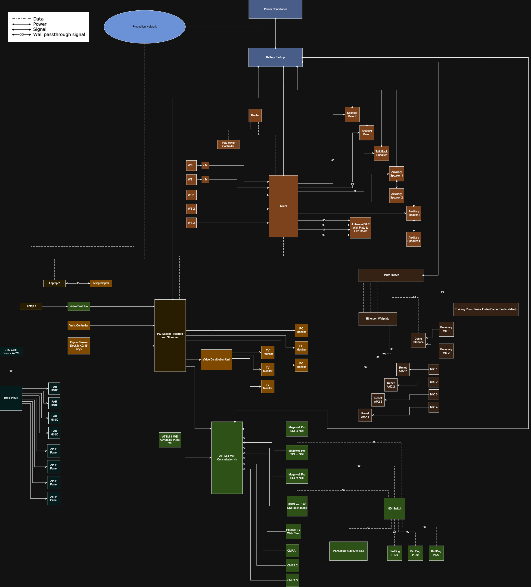

# Multi-Use Broadcast & Recording Studio System Design
Several years back, I was challenged to build a multi-use production studio under a conservative budge.
It was tough—but incredibly fun, and the result is a highly adaptable AV + lighting + networking setup that supports a main studio, attached live room, and flexible event hall—all engineered to handle a wide (and unpredictable) range of production needs: such as podcasts, live streams, music production/band tracking, corporate events, and beyond.

I'm sharing this repo to act as a template for others and will include architecture, diagrams, equipment lists, wiring plans, and rationale so others can replicate, adapt, or improve it.

## System Overview

The system leverages modern broadcast and AV technologies such as Dante, NDI, POE, and 12gSDI to create a scalable and adaptable production workflow. It is designed around a centralized production control room which manages audio mixing, video switching, recording, and live streaming for the attached live room and seperated event space. 

## Audio System
The audio system is processed by an Allen & Heath SQ-5 digital mixer with a Dante I/O expansion card for routing audio between rooms.

Components
- Allen & Heath SQ-5 mixer with 32x32 Dante I/O
- Dedicated PoE Dante network switch (Netgear AV Line M4250)
- Dante boundary microphones for event hall capture
- Dante integration with Tesira Forte DSP
- Talkback paging system
- Audio wall plate connectivity from studio control room to live room

## Video System
Video production is powered by the Blackmagic ATEM production ecosystem, which supports 12gSDI switching, recording, and streaming.

Components
- ATEM 4 M/E Constellation 4K video switcher
- ATEM 1 M/E Advanced Panel 20 control surface
- vMix streaming and recording workstation
- Elgato Stream Deck controller

Camera system
- 2× BirdDog P120 Full NDI PTZ cameras in Event Hall
- 3x Canon XF605 UHD Camcorders in Live Room
- 2x Magewell NDI-to-SDI converters
- PTZOptics SuperJoy camera controller

The system supports NDI camera feeds from the event hall to the studio control room.

## Podcast Production System

Components
- RedNet AM2 Dante headphone interfaces
- Dedicated podcast monitoring displays
- Remote guest video interaction system
- Integrated webcam solution

Audio from remote participants is routed through the SQ-5 and returned to the monitoring interfaces for hosts.

## Lighting System for Studio

Equipment
- CHAUVET COLORdash PAR H18X RGBWA+UV wash lights
- ETC ColorSource AV 20 lighting console
- CHAUVET OnAir IP LED soft lights

Lighting is controlled through DMX patch panels distributed across the studio and live room, allowing flexible lighting layouts.

## Production Workstation
Custom workstation designed for demanding video effects and 4k multi-stream recording for 12bit 4:4:4 color depth. 

Our configuration
- Intel i9-13900K CPU
- RTX 4080 Super GPU for AV1 encoding
- Blackmagic DeckLink 8K Pro capture card
- NVMe storage array for high-bitrate recording
- ASUS ProArt Z790 Creator motherboard

The workstation runs vMix production software for recording and streaming.

## Power Protection

- UPS Battery backup
- Power Conditioning Unit

## Technology Used

- diagrams.net (draw.io)
- Dante audio networking
- NDI Video Networking
- 12G SDI Broadcast Video
- Biamp Tesira Software
- NDI
- vMix
- Reaper
- Dante audio networking

